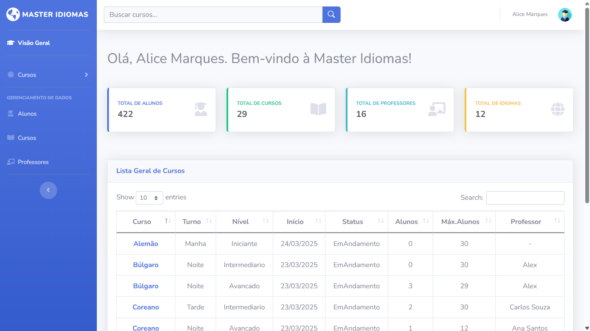

# 🌍 Master Idiomas



Master Idiomas é um sistema de gerenciamento para escolas de idiomas, desenvolvido em ASP.NET Core MVC. 
A plataforma permite o gerenciamento eficiente de cursos, professores, alunos e usuários, oferecendo 
funcionalidades essenciais para a administração acadêmica e operacional.
O sistema possui uma interface intuitiva para cadastro, edição, exclusão e visualização de registros
Além disso, conta com recursos de segurança e controle de acesso.

## Principais Funcionalidades

🔧 Gerenciamento CRUD Completo: Permite o gerenciamento de cursos, professores, alunos e usuários, com validações de dados e relacionamentos entre os registros.

🔐 Sistema de Login: Sistema de login seguro, com autenticação baseada em cookies e verificação de identidade, garantindo acesso autorizado ao sistema.

📧 Redefinição de Senha via Email (SMTP): Envio de email com nova senha do usuário.

🔑 Alteração de Senha: Permite a alteração de senha pelo usuário, com verificação de senha atual e novas senhas que atendem a critérios de segurança.

⚙️ Filtros de Autorização: Controle de acesso utilizando filtros de autorização, garantindo que apenas usuários com permissões adequadas possam acessar determinadas páginas.

🛡️ Segurança: Segurança robusta contra ataques comuns como SQL Injection, XSS e CSRF, utilizando Razor, tokens anti-forgery, e LINQ com Entity Framework para consultas seguras. Validação de entradas nos formulários e restrições para garantir a segurança dos dados.

🔄 Entity Framework ORM: Utilização do Entity Framework Core como ORM para interagir com o banco de dados SQL Server, aproveitando migrations automáticas para facilitar a evolução do esquema de dados.

🔒 Proteção de Senha: Criptografia de senhas, utilizando o algoritmo SHA-1.

👤 Sessão do Usuário: Gerenciamento da sessão do usuário com armazenamento seguro em cookies, garantindo que o usuário permaneça autenticado durante a navegação.

📊 Logs de Atividade do Usuário: Logs de atividades do usuário registrados com Serilog, para monitoramento e diagnóstico.

## Tecnologias Usadas

### **Back-End**
 |  |  | 

### **Front-End**
 |  |  |  | 


## Instalação

### ✅ Pré-requisitos

Antes de rodar o projeto, você precisa ter:

- [Visual Studio 2022+](https://visualstudio.microsoft.com/) com suporte para **ASP.NET Core** e **.NET 8.0**
- [.NET SDK 8.0](https://dotnet.microsoft.com/en-us/download/dotnet/8.0)
- [SQL Server](https://www.microsoft.com/en-us/sql-server/sql-server-downloads) instalado e rodando localmente
- Compatível com: **Windows**, **macOS** e **Linux**

### 🧩 Passo a passo

#### 1️⃣ Clone o repositório

```bash
git clone https://github.com/alicemarquesdev/MasterIdiomas.git
```

#### 2️⃣ Restaure os pacotes NuGet

```bash
dotnet restore
```

Pacotes NuGet utilizados:

- Microsoft.EntityFrameworkCore (9.0.3)
- Microsoft.EntityFrameworkCore.Design (9.0.3)
- Microsoft.EntityFrameworkCore.SqlServer (9.0.3)
- Microsoft.EntityFrameworkCore.Tools (9.0.3)
- Newtonsoft.Json (13.0.3)
- Serilog.AspNetCore (9.0.0)
- Serilog.Sinks.Console (6.0.0)
- Serilog.Sinks.File (6.0.0)

#### 3️⃣ Configure o appsettings.json

Crie ou edite o arquivo appsettings.json com suas informações de conexão e SMTP:

```bash
{
  "Logging": {
    "LogLevel": {
      "Default": "Information",
      "Microsoft.AspNetCore": "Warning"
    }
  },
  "Serilog": {
    "Using": [ "Serilog.Sinks.File" ],
    "MinimumLevel": "Information",
    "WriteTo": [
      {
        "Name": "File",
        "Args": {
          "Path": "logs/app.log",
          "RollingInterval": "Day",
          "RetainedFileCountLimit": 7,
          "FileSizeLimitBytes": 10485760,
          "Buffered": true
        }
      }
    ]
  },
"ConnectionStrings": {
    "DataBase": "Server=localhost;Database=NomeDoBanco;Trusted_Connection=True;MultipleActiveResultSets=true;TrustServerCertificate=True"
},
  "EmailSettings": {
    "SmtpServer": "smtp.gmail.com",
    "SmtpPort": 587,
    "SenderEmail": "seuemail@dominio.com",
    "SenderPassword": "suasenha"
  },
  "AllowedHosts": "*"
}
```

#### 4️⃣ Aplicar as Migrations

Aplicar as migrations para criar o esquema do banco de dados:

```bash
dotnet ef migrations add InitialCreate
dotnet ef database update
```

#### 5️⃣ Execute o projeto

No Visual Studio, clique em Iniciar (F5) ou use: 
```bash
dotnet run
```

#### 6️⃣ Acesse no navegador

O projeto estará disponível em:
```bash
http://localhost:5001
```
Ou a porta definida no launchSettings.json.

## Licença

Este projeto está licenciado sob a Licença MIT. Veja o arquivo [LICENSE.txt](LICENSE.txt) para mais detalhes.

## Contato

🔗[**LinkedIn**](https://linkedin.com/in/alicemarquesdev)  |
 📧 [**E-mail**](mailto:alicemarques.dev@hotmail.com)  |
🌐 [**Portfólio**](https://alicemarquesdev.github.io/portfolio-AM/) 
